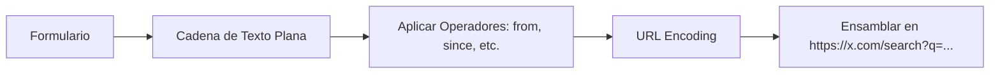

# 🛠️ Manual Técnico: Construcción de Queries para Búsqueda Avanzada en X

Esta guía detalla cómo transformar los parámetros del formulario de **Búsqueda Avanzada de X** en una URL funcional. La clave reside en el parámetro de consulta `q` y el uso correcto de **operadores booleanos** y **filtros de metadatos**.

---

## 🏗️ Estructura de la URL de Búsqueda

La URL base para realizar búsquedas en X es:
`https://x.com/search?q=[QUERY_CODIFICADO]&src=typed_query`

- **`q`**: Es la cadena de búsqueda que contiene todos los términos y operadores.
- **`src=typed_query`**: Indica que la consulta fue ingresada manualmente, asegurando que X procese los operadores técnicos correctamente.

---

## 📋 Diccionario de Operadores Técnicos

A continuación, se muestra el mapeo entre los campos del formulario y su representación en la cadena de texto:

### 1. Sección: Palabras (Words)
| Campo Formulario | Operador | Ejemplo Técnico |
| :--- | :--- | :--- |
| Todas estas palabras | (espacio) | `banxico economia` |
| Frase exacta | `" "` | `"banco de mexico"` |
| Cualquiera de estas palabras | `OR` | `inflacion OR deflacion` |
| Ninguna de estas palabras | `-` | `-deuda` |
| Hashtags específicos | `#` | `#Finanzas` |
| Idioma específico | `lang:` | `lang:es` |

### 2. Sección: Personas (People)
| Campo Formulario | Operador | Ejemplo Técnico |
| :--- | :--- | :--- |
| De estas cuentas | `from:` | `from:banxico` |
| A estas cuentas | `to:` | `to:AbelVicencio` |
| Mención de cuentas | `@` | `@banxico` |

### 3. Sección: Interacción (Engagement)
| Campo Formulario | Operador | Ejemplo Técnico |
| :--- | :--- | :--- |
| Mínimo de respuestas | `min_replies:` | `min_replies:5` |
| Mínimo de Me gusta | `min_faves:` | `min_faves:100` |
| Mínimo de Reposts | `min_retweets:` | `min_retweets:20` |

### 4. Sección: Fechas (Dates)
| Campo Formulario | Operador | Formato |
| :--- | :--- | :--- |
| Desde (Fecha inicial) | `since:` | `YYYY-MM-DD` |
| Hasta (Fecha final) | `until:` | `YYYY-MM-DD` |

---

## ⚡ Guía de Codificación URL (Percent-Encoding)

Para que la URL sea válida, los caracteres especiales deben convertirse a su formato hexadecimal:

- **Espacio** (` `) → `%20`
- **Comillas** (`"`) → `%22`
- **Dos puntos** (`:`) → `%3A`
- **Hashtag** (`#`) → `%23`
- **Arroba** (`@`) → `%40`
- **Caracteres con acento** (e.g., `ó`) → `%C3%B3`

---

## 🔍 Análisis del Ejemplo Solicitado

El usuario proporcionó la siguiente URL:
`https://x.com/search?q=banxico%20%22banco%20de%20mexico%22%20-inflaci%C3%B3n%20min_replies%3A2%20min_retweets%3A29%20until%3A2024-09-19%20since%3A2008-10-19&src=typed_query`

### Desglose del Query (`q`):
1.  `banxico`: Busca posts con la palabra "banxico".
2.  `"banco de mexico"`: Busca la frase literal exacta.
3.  `-inflación`: Excluye cualquier post que mencione "inflación".
4.  `min_replies:2`: Solo posts con 2 o más respuestas.
5.  `min_retweets:29`: Solo posts con 29 o más reposts.
6.  `until:2024-09-19`: Límite superior de fecha.
7.  `since:2008-10-19`: Límite inferior de fecha.

### Diagrama de Flujo de Construcción:

---

## 💡 Pro Tips

1.  **Orden de los factores**: X suele procesar mejor los términos de texto al principio y los filtros de metadatos (`since`, `min_retweets`) al final.
2.  **Combinación Booleana**: Puedes usar paréntesis para agrupaciones complejas: `(banxico OR "banco de mexico") -inflación`.
3.  **Filtro de Multimedia**:
    - `filter:images` (Solo posts con imágenes)
    - `filter:videos` (Solo posts con videos)
    - `filter:links` (Solo posts con enlaces externos)
